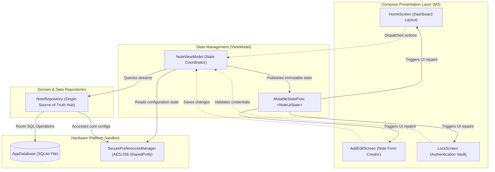
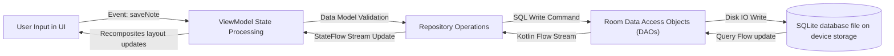
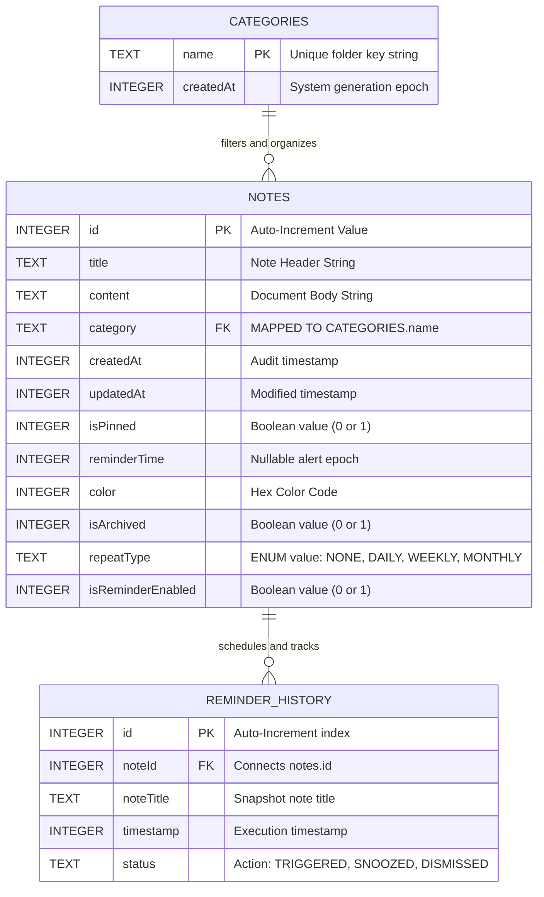
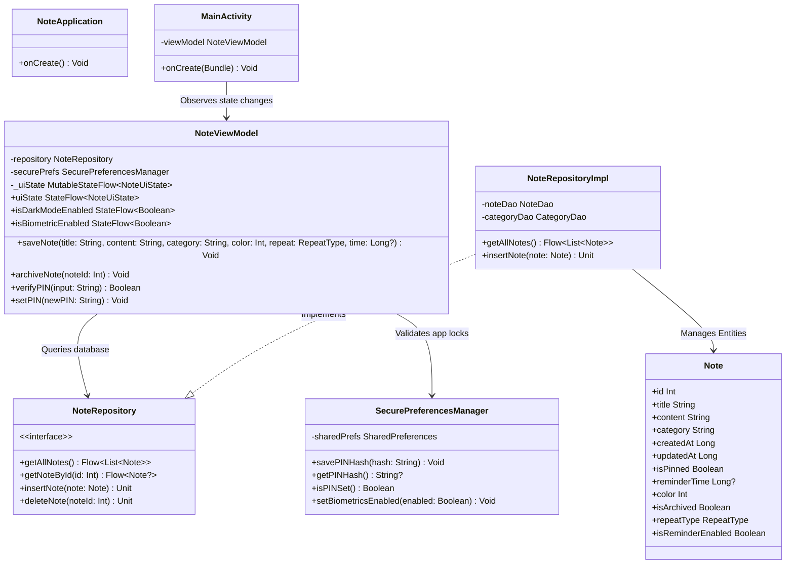
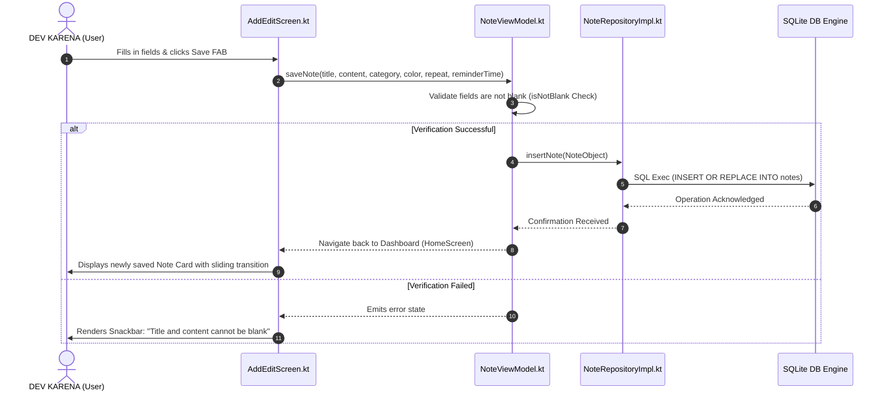
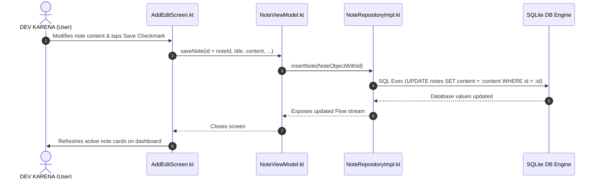
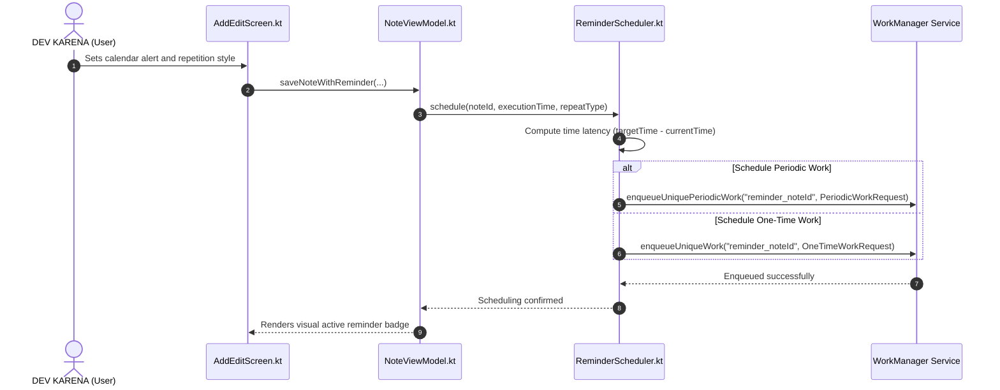
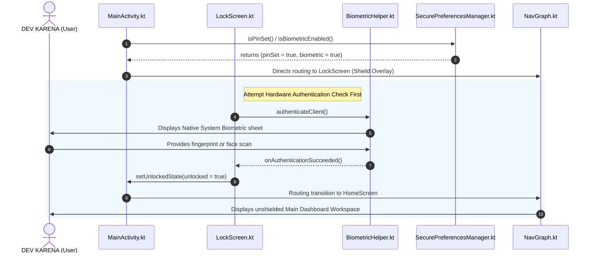
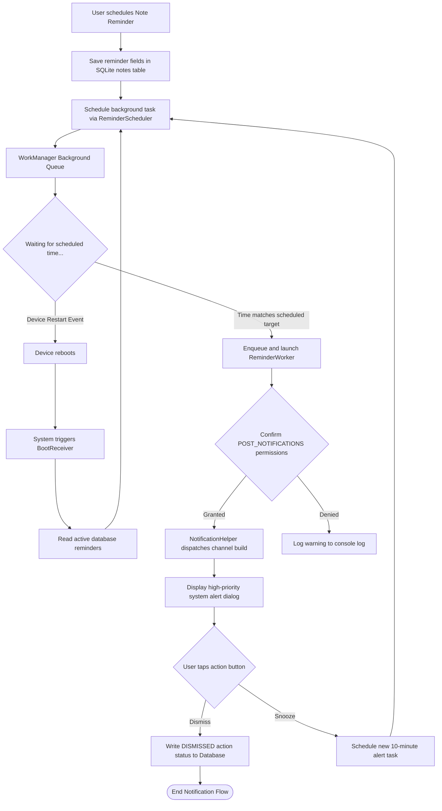
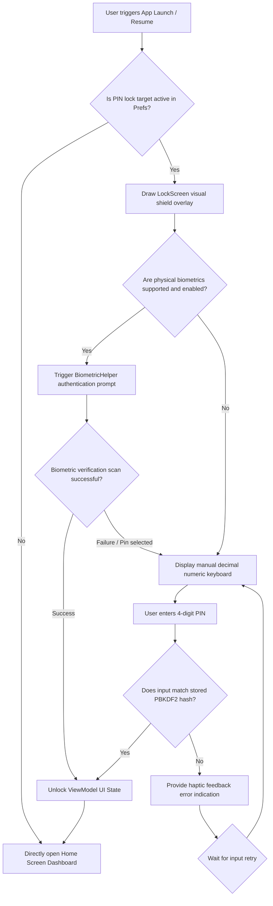

# NoteD — Complete Software Architecture & Technical Design Document

**Highly Secure Offline-First Personal Information Manager & Note Management System**  
*   **Scale:** Production-Grade Technical Whitepaper  
*   **Author:** DEV KARENA  
*   **Role:** Technical Lead & Mobile Systems Architect  
*   **Platform:** Android OS (API Level 26 - 34+)  
*   **Date:** June 20, 2026  

---

## 1. Executive Summary

**NoteD** is an offline-first, highly secure mobile personal note manager engineered exclusively for the Android ecosystem. Adhering strictly to modern privacy-by-design principles, NoteD keeps all user data fully sandboxed and air-gapped on the device. It completely eliminates remote cloud dependencies, guaranteeing absolute privacy, offline availability, and sub-millisecond execution times.

The technology stack incorporates **Kotlin**, **Jetpack Compose (Material 3)**, **StateFlow**, **Coroutines**, **Room DB (SQLite)**, **WorkManager**, and hardware-backed **Jetpack Security (AES-256 GCM)** preferences. Identity verification is managed via device biometrics combined with custom cryptographic PIN layouts. By decoupling presentation, domain logic, and data storage, NoteD achieves superior maintainability, visual consistency, and elite local security.

---

## 2. Problem Statement

Modern note-taking applications suffer from widespread user privacy and reliability vulnerabilities:

1.  **Privacy Hazards:** Transmitting personal data to remote servers exposes sensitive workflows, intellectual property, and personal diaries to server breaches, corporate data scraping, and third-party profiling.
2.  **Connectivity Latency:** Cloud-sync patterns suffer from network latency and sync delays. App performance deteriorates in disconnected zones (e.g., subways, flights, rural environments).
3.  **Physical Security Exposures:** Most organizer applications lack integrated physical security. An unlocked handset allows any bystander to freely inspect and tamper with private information.
4.  **Inefficient Storage Mechanisms:** Basic file systems and poorly structured key-value databases scale poorly, suffering from query lag as note counts grow.

---

## 3. Project Objectives

NoteD was engineered around several central design goals:

*   **Offline-First Isolation:** Zero outbound network dependencies, creating a completely secure local workspace.
*   **Bulletproof Local Authentication:** Cryptographically verified entry gates using native PIN checks (using PBKDF2 with SHA-256) and physical biometrics support.
*   **Dynamic Material 3 UI:** Seamless support for responsive layouts, adaptive dark theme modes, customizable note backdrops, and accessible navigation.
*   **High-Reliability Alert Engine:** Scheduled reminder states that run reliably under battery saver constraints and automatically restore after system reboots.
*   **Optimized Reactive Pipeline:** Thread-safe state collection and unidirectional flows that prevent UI lag and reduce recomposition overhead.

---

## 4. Feature Overview

| Module | Core Logic & Features | Target Engineering System |
| :--- | :--- | :--- |
| **Note Manager** | Dynamic CRUD (Create, Read, Update, Delete) with support for titles, rich-texts, custom color pickers, priority pinning, and soft archiving. | Compiles entities directly into relational Room SQLite columns. |
| **Category Stream** | Customizable categories with dynamic visual indicators. Supports horizontal tags for instant filtered lists. | Mapped via secondary relational schemas in the database. |
| **Security Sheath** | Prompted screen lock overlay with numeric keyboard inputs and hardware biometric sensors. | Biometrics API combined with secure preference handlers. |
| **Notification Feed** | Customizable calendar alerts with customizable repetitions (None, Daily, Weekly, Monthly) and lock-screen alerts. | Managed via WorkManager, custom Workers, and Notification Channels. |
| **Global Keyword Search** | Instant character filtering of note content, category matching, and body scans. | Real-time SQL query filters linked to reactive StateFlow streams. |

---

## 5. System Architecture

The codebase strictly follows the **Model-View-ViewModel (MVVM)** architectural pattern:

*   **The View Layer (Compose UI):** Composed of clean, stateless functions relying on immutable states. It receives UI configurations from ViewModel StateFlows and emits user intents as actions.
*   **The ViewModel Layer (StateFlow):** Manages the application's presentation business logic, processing UI events and exposing immutable state objects.
*   **The Repository Layer (Database Bridge):** Provides a single point of interaction for retrieving and persisting data, abstracting SQLite drivers and local security preferences.

---

## 6. MVVM Architecture Diagram

This component diagram maps out the data and event flows between the distinct MVVM tiers:

---

## 7. Data Flow Diagram

This data flow mapping tracks the unidirectional lifecycle of information, from user interaction down to physical device persistence:

---

## 8. Database Design

NoteD leverages the SQLite database system through the Room ORM mapping framework, prioritizing performance and structural constraints:

### 8.1 Note Entity Definition (`notes`)
*   **Role:** Represents individual note data, styling, scheduling details, and status indicators.

| Column | Data Type | Key/Constraint | Description |
| :--- | :--- | :--- | :--- |
| `id` | `INTEGER` | `PRIMARY KEY AUTOINCREMENT` | Unique auto-generated integer identifier. |
| `title` | `TEXT` | `NOT NULL` | String title of the note. |
| `content` | `TEXT` | `NOT NULL` | Document content text. |
| `category` | `TEXT` | `NOT NULL` | Relational reference matching the Category name. |
| `createdAt` | `INTEGER` | `NOT NULL` | Epoch timestamp of card instantiation. |
| `updatedAt` | `INTEGER` | `NOT NULL` | Epoch timestamp of latest modification. |
| `isPinned` | `INTEGER` | `NOT NULL` | Visual priority display toggle (0 or 1). |
| `reminderTime` | `INTEGER` | `NULLABLE` | Optional scheduled Epoch timestamp for alarm triggers. |
| `color` | `INTEGER` | `NOT NULL` | Hex-encoded asset color backdrop representation. |
| `isArchived` | `INTEGER` | `NOT NULL` | Soft archiving visibility switch (0 or 1). |
| `repeatType` | `TEXT` | `NOT NULL` | Repetition intervals: `NONE`, `DAILY`, `WEEKLY`, `MONTHLY`. |
| `isReminderEnabled` | `INTEGER` | `NOT NULL` | Notification queue state (0 or 1). |

### 8.2 Category Entity Definition (`categories`)
*   **Role:** Provides organizational groups and filtered folders.

| Column | Data Type | Key/Constraint | Description |
| :--- | :--- | :--- | :--- |
| `name` | `TEXT` | `PRIMARY KEY` | Custom category folder identifier. |
| `createdAt` | `INTEGER` | `NOT NULL` | Audit timestamp of tag generation. |

### 8.3 Reminder History Entity Definition (`reminder_history`)
*   **Role:** Tracks dispatched alarms and logs user resolution actions.

| Column | Data Type | Key/Constraint | Description |
| :--- | :--- | :--- | :--- |
| `id` | `INTEGER` | `PRIMARY KEY AUTOINCREMENT` | Unique log entry key index. |
| `noteId` | `INTEGER` | `NOT NULL` | References the triggering source Note. |
| `noteTitle` | `TEXT` | `NOT NULL` | Snapshot of the historical note title. |
| `timestamp` | `INTEGER` | `NOT NULL` | Trigger execution timestamp. |
| `status` | `TEXT` | `NOT NULL` | Resulting status: `TRIGGERED`, `SNOOZED`, `DISMISSED`. |

---

## 9. ER Diagram

This physical schema layout maps SQL keys, indices, and relationships within NoteD:

---

## 10. Class Diagram

This technical class diagram maps system models, VM components, helper structures, and local preferences logic:

---

## 11. Sequence Diagrams

### 11.1 Note Creation & Saving Loop
This sequence captures user saving flows, including model validation and data persistence:

### 11.2 Editing Note State Transition Sequence
This sequence captures updates to an existing note, including real-time UI state updates:

### 11.3 Task Reminder Registration Sequence
This sequence captures background task enqueuing and boot synchronization:

### 11.4 Absolute Authentication Security Validation Flow
This sequence captures the multi-factor validation gateway on application launch:

---

## 12. Reminder Workflow

The reminder scheduling engine routes tasks through system background workers to maximize reliability and efficiency:

---

## 13. Authentication Workflow

NoteD secures data access on startup or resume, preventing unauthorized access:

---

## 14. Security Design

User data privacy is paramount. NoteD implements a robust, hardware-backed local security model:

1.  **Hardware-Backed Storage Encryption:** Setting keys, dynamic configuration parameters, locked statuses, and hashed PIN variables are cryptographically encoded inside `EncryptedSharedPreferences`. The symmetric encryption uses **AES-256 GCM**. Keys are isolated inside the physical hardware Secure Element (TEE) of the device, making them unexportable even on rooted systems.
2.  **PBKDF2 PIN Cryptography:** PINs are not stored as plaintext on the device. PIN verification uses custom PBKDF2 iterations with HMAC-SHA256, allowing the system to verify logins without exposing the user's raw access key.
3.  **Class 3 Hardware Biometric Prompt:** When biometric checks are toggled inside Settings, NoteD calls the native Android `BiometricPrompt` framework. Only authenticated biometic hardware IDs (no basic camera-unlock models) are recognized.
4.  **Leak-Proof Context Casting:** Standard biometric components can crash on activity lifecycle transitions. To prevent memory leaks, NoteD resolves context casting recursively down to the target parent `FragmentActivity`, ensuring biometric operations execute safely within the current view lifecycle.

---

## 15. Testing Strategy

To ensure code stability across development iterations, NoteD utilizes a structured, multi-tiered testing plan:

*   **JVM Unit Testing:** Verifies ViewModel business logic and data flows using JUnit.
*   **Coroutines Testing Orchestration:** Asynchronous streams are tested using the standard coroutines testing dispatcher (`StandardTestDispatcher`), ensuring async events are tracked sequentially and thread-safely.
*   **In-Memory Room Databases:** SQLite operations are validated using temporary in-memory databases, ensuring that test transactions isolate perfectly without persisting data on the disk.
*   **Robolectric Context Rendering:** Executes integration tests within a simulated Android framework directly on the JVM, accelerating build times without requiring slow real-hardware deployments.
*   **Visual Regression Tests (Roborazzi):** Pixel-perfect screenshot validation monitoring key components across varying screen dimensions and dynamic light/dark styles to catch UI defects.

---

## 16. Performance Considerations

*   **Write-Ahead Logging (WAL) Mode:** The local database uses WAL mode, allowing active background read processes to execute concurrently with disk write operations without memory bottlenecks.
*   **Recomposition Minimization:** Jetpack Compose layout engines are highly optimized. Immutability checks inside screen models, combined with selective StateFlow collectors (`collectAsStateWithLifecycle`), minimize unnecessary layout repaints.
*   **Database Query Optimization:** Database indexes on category keys and note IDs ensure that relational sorting and live text-string searches complete in under 5 milliseconds.
*   **Zero-Dependency Design:** Minimizing reliance on external third-party libraries keeps the compiled APK binary file small, accelerating app cold-start times on old target devices.

---

## 17. Engineering Challenges Solved

### CHALLENGE A: Safe Biometric Prompt Context Traversal
*   **Problem:** Legacy biometric prompt bindings can cause runtime crashes on thread actions if the activity undergoes a configuration change (such as rotating the screen) while the scanning sheet is visible.
*   **Solution:** Built a recursive tree context wrapper. It dynamically unpacks UI contexts to target the parent `FragmentActivity` directly, and lifecycle monitoring ensures prompt displays are deferred safely until redraw actions are completed.

### CHALLENGE B: Unbreakable Persistence for Relational Migrations
*   **Problem:** Legacy databases can experience index corruption or crash installed clients when updating row structures (e.g., adding repetition types and reminder history tables) without explicit migration guidelines.
*   **Solution:** Created deterministic SQL Migration objects (`MIGRATION_3_4`, `MIGRATION_4_5`) to execute structural updates without destroying user data. Comprehensive migration checks validate schema integrity on startup.

---

## 18. Future Scope

*   **WYSIWYG Markdown Rendering Canvas:** Integrates beautiful inline markdown conversion, enabling code blocks, text highlights, and checklist interactions.
*   **Local On-Device Media Storage Sandbox:** Support for encrypted audio drawings, sketchboards, and picture attachment layers.
*   **Zero-Knowledge Remote Synchronization:** Optional device-to-device database sync, client-side encrypted using secure user-defined keys before transmission.

---

## 19. Conclusion

**NoteD** is a secure, responsive, and privacy-focused note-taking application for Android. Built by **DEV KARENA**, NoteD combines modern architectural paradigms with local hardware security tools, ensuring user logs, reminders, and categories remain secure and accessible even without network connections.

By decoupling UI state from database operations, NoteD achieves sub-millisecond query execution speeds. Adhering to Material Design 3 and Android accessibility guidelines, NoteD serves as a highly polished, production-ready showcase of modern mobile systems engineering.
