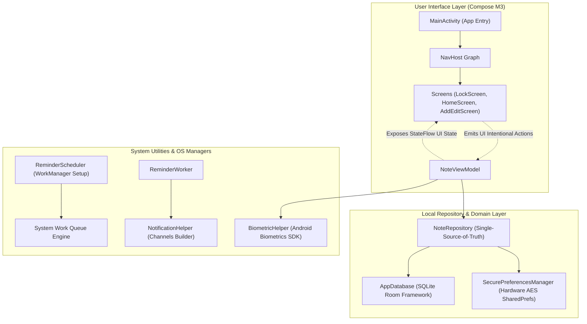

# NoteD — Secure Offline-First Android Note Management System

[](https://kotlinlang.org)
[](https://developer.android.com)
[](https://developer.android.com/topic/architecture)
[](https://developer.android.com/jetpack/compose)
[](https://developer.android.com/training/data-storage/room)
[](https://developer.android.com/topic/security/data)

---

## 1. Project Overview

**NoteD** is a production-grade, highly secure, offline-first personal information manager and note-taking application designed for modern Android devices. Engineered by **DEV**, NoteD integrates hardware-backed biometric authentication, encrypted local persistence, and background task management. Adhering to privacy-by-design directives, NoteD runs completely air-gapped; all note content, categories, configuration preferences, and reminders are processed and stored strictly on-device.

---

## 2. Key Features

*   **Dynamic Note Lifecycle:** Fully featured CRUD manager supporting title, rich text contents, dynamic custom background colors, card metadata representation, pin/unpin prioritization, soft-archiving, and permanent trash deletion.
*   **Hierarchical Category Organiser:** Fast, user-defined folder arrays tagged with dynamic UI colors for rapid stream categorization and filtering.
*   **App Lock Shield Protection:** Cryptographically enforced application shields executing via local secure PIN locks (using PBKDF2 derivative evaluations) and biometric verification.
*   **Offline-First Architecture:** Eliminates network latencies and preserves bandwidth by reading and writing exclusively to an isolated SQLite data access engine.
*   **Secure Preferences Sandbox:** Device-specific configurations (such as dark mode toggle, grid states, and PIN locks) are securely encrypted on-device.
*   **Robust Reminder Orchestrator:** Schedules highly reliable context alerts utilizing the Android `WorkManager` API. Integrates boot broadcasters to automatically reschedule pending reminders upon device reboots.
*   **Global Full-Text Search:** Instantaneous keyword search across note titles, categories, and bodies, matching terms via a continuous reactive stream state.

---

## 3. Screen Walkthrough

### Lock Screen & Vault Gateway
Upon cold start or background-entry resume (if lock settings are engaged), the app presents an authentic lock shield layout. The user must provide their 4-digit security PIN or scan their registered Class 3 biometrics (fingerprint/face unlock) to trigger state decryption.

### Dashboard & Category Ribbons
Displays pinned priority notes in a prominent top grid, followed by all recent notes. A horizontal category filter bar allows tapping folders (e.g., *Work*, *Personal*, *Ideas*) to filter the dashboard grid. Includes a togglable list/grid mode.

### Note Creator & Customizer
An open writing space supporting dynamic color thematic background picker palettes, automatic timestamp updates, category assignment dropdowns, and interactive scheduled alarms.

---

## 4. Technology Stack & Dependencies

*   **Core Language:** [Kotlin 1.9.22](https://kotlinlang.org/) for modern functional programming paradigms and clean execution flow.
*   **Reactive Flow Engine:** [Kotlin Coroutines](https://kotlinlang.org/docs/coroutines-overview.html) & [StateFlow](https://kotlinlang.org/api/kotlinx.coroutines/kotlinx-coroutines-core/kotlinx.coroutines.flow/-state-flow/) for active, thread-safe asynchronous stream propagation from base models to the visual layout.
*   **Declarative UI Framework:** [Jetpack Compose (M3)](https://developer.android.com/jetpack/compose) referencing Material Design 3 guidelines, dynamic adaptive light/dark UI palettes, and smooth cross-screen fade animations.
*   **Local Persistence Engine:** [Room SQLite](https://developer.android.com/training/data-storage/room) abstracting structural database entities, utilizing Write-Ahead Logging (WAL) for responsive I/O throughput.
*   **Background Tasks:** [WorkManager SDK](https://developer.android.com/topic/libraries/architecture/workmanager) for battery-conscious background task execution.
*   **Local Cryptography:** [Jetpack Security](https://developer.android.com/topic/security/data) representing AES-256 GCM encrypted shared preferences backed by the on-device hardware Google KeyStore.
*   **Biometrics SDK:** [Android Biometrics Library](https://developer.android.com/training/sign-in/biometric-auth) managing Android biometric integrations.

---

## 5. Architectural Blueprint

The application is structured upon the modern **Model-View-ViewModel (MVVM)** pattern, executing a **Unidirectional Data Flow (UDF)** loop:



---

## 6. Directory Map & Project Structure

```lispt
.
├── app
│   ├── build.gradle.kts        # Root system build & module dependencies
│   └── src
│       ├── main
│       │   ├── AndroidManifest.xml  # Core application configs, alarm permissions
│       │   ├── java/com/example
│       │   │   ├── NoteApplication.kt   # App runtime entry representing WorkManager setup
│       │   │   ├── MainActivity.kt      # Primary hardware Activity binding authentication
│       │   │   ├── data
│       │   │   │   ├── local
│       │   │   │   │   ├── dao          # Room SQL data access interfaces (Note, Category, History)
│       │   │   │   │   ├── database     # DB builder, schema migrations (V3 to V5)
│       │   │   │   │   └── entity       # Note, Category, ReminderHistory data models
│       │   │   │   └── repository       # Concrete Clean Repository abstractions
│       │   │   ├── reminder
│       │   │   │   ├── NotificationHelper.kt   # Creates visual notification channel layouts
│       │   │   │   ├── ReminderReceiver.kt     # Listens to scheduled alert triggers
│       │   │   │   ├── ReminderScheduler.kt    # Orchestrates WorkManager triggers (One-Time/Periodic)
│       │   │   │   └── ReminderWorker.kt       # Background WorkRequest processor
│       │   │   ├── security
│       │   │   │   ├── BiometricHelper.kt      # Fingerprint/Face validation controller
│       │   │   │   └── SecurePreferencesManager.kt # AES-GCM Encrypted SharedPreferences container
│       │   │   └── ui
│       │   │       ├── navigation   # Decoupled navigation graphs and routing
│       │   │       ├── screens      # Material 3 screen layouts: Lock, Home, Detail, Creator
│       │   │       ├── theme        # Centralized app styling, colors, and typography
│       │   │       └── viewmodel    # NoteViewModel coordinating actions and states
│       │   └── res                  # Vector maps, themes.xml configurations
│       └── test/java/com/example    # Robolectric database simulation suites
└── README.md
```

---

## 7. Installation Instructions

### Prerequisites
1.  **JDK Version:** Java Runtime 17 configured in your execution environment.
2.  **SDK Versions:** Android compiler target set to `compileSdk 34` with a backward minimum target of `minSdk 26`.
3.  **Android Studio:** Version Jellyfish (2023.3.1) or Ladybug (2024.1.1) or newer.

### Installation Steps
1.  **Clone the Repository:**
    ```bash
    git clone https://github.com/DEV/NoteD.git
    cd NoteD
    ```
2.  **Set up the Environmental Configuration:**
    Ensure you specify necessary developer parameters by replicating the environment file template:
    ```bash
    cp .env.example .env
    ```
3.  **Open in IDE:**
    Launch Android Studio, select **Open Folder**, choose the local `NoteD` project root, and allow the system to download and synchronize the Gradle catalog files.

---

## 8. Running the Project

### Command-Line Compilation
Perform standard module verification and compilation by running Gradle wrapper tasks:
```bash
# Clean historical artifacts
gradle clean

# Run compile assertions
gradle assembleDebug

# Run unit tests on local JVM
gradle :app:testDebugUnitTest
```

### IDE Run & Flash Commands
1.  Enable **Developer Mode** and **USB Debugging** on your testing device (Settings -> About Phone -> Tap *Build Number* 7 times, then go to Developer Options -> Toggle *USB Debugging*).
2.  Select your targeted device in Android Studio's runner toolbar dropdown.
3.  Click the green **Run** button or execute:
    ```bash
    gradle installDebug
    ```

---

## 9. Design Decisions (ADRs)

*   **ADR 01: Offline-First SQLite Domain over Cloud Databases:** Keeps personal journal data air-gapped on-device to guarantee absolute user privacy, offline operational stability, and sub-millisecond data query performance.
*   **ADR 02: WorkManager over Legacy AlarmManager for Reminders:** Deployed standard Google `WorkManager` API to guarantee tasks execute even if system power states scale to Deep sleep/Doze settings, while automatically avoiding execution blocks or operating system constraints on Android 14+.
*   **ADR 03: Unified ViewModel State-Flow Architecture:** Replaced loose single-value LiveData structures with cohesive StateFlow payloads. State flows are naturally integrated with Kotlin coroutines.
*   **ADR 04: Jetpack Cryptoframework Encryption over Sandbox Privacy:** Since the standard sandbox can be compromised on rooted devices, the app uses 256-bit AES symmetric preferences encryption with keys stored in the on-device Secure Element.

---

## 10. Engineering Challenges Solved

### 1. Robust Lifecycle-Safe Biometrics
*   **Problem:** Standard hardware biometric prompt invocations trigger app crashes if activity contexts undergo configuration events (like sudden screen orientation rotation) on thread triggers.
*   **Solution:** Resolved by binding biometric execution prompts explicitly to the `FragmentActivity` context level, using a context wrapper traversal look-up utility that stops and holds UI callbacks until the parent state has completed its activity redraw cycle.

### 2. Multi-Version Database Transitions
*   **Problem:** Upgrading database structures (e.g., adding repetition types inside notes and creating a historical tracking table) causes crashes on installed clients without explicit migrations.
*   **Solution:** Implemented structured SQL Migration objects (`MIGRATION_3_4`, `MIGRATION_4_5`) registered inside the Room database builder, ensuring dynamic migration is checked on setup without destroying user data.

---

## 11. Learning Outcomes & Highlights

*   Mastered the development of highly private, air-gapped mobile environments utilizing hardware cryptography.
*   Configured advanced Kotlin Coroutines state systems (`collectAsStateWithLifecycle`) to optimize layout recomposition overhead within the Jetpack Compose environment.
*   Structured a complete Android background service architecture using WorkManager to schedule background notifications across system reboots.

---

## 12. Future Product Enhancements
*   **Rich Markdown Editor:** Dynamic inline parsing of markdown blocks with interactive checklist state updates.
*   **Secure Backup Sync:** An optional end-to-end user-managed cloud backup provider system, encrypted client-side using zero-knowledge protocols.
*   **Visual Elements:** Support for local media attachments, sketch drawing layers, and embedded audio notes.

---

## 13. License

Designed and engineered by **DEV** (2026). All source code and resources are distributed under the **MIT License**.
