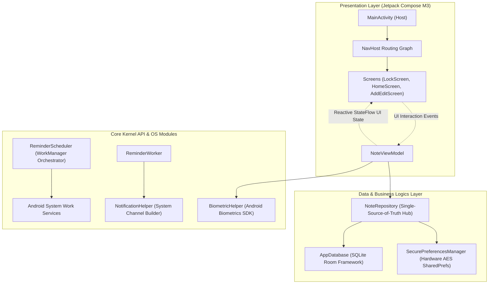

# NoteD — Secure Offline-First Android Note Management System

[](https://kotlinlang.org)
[](https://developer.android.com)
[](https://developer.android.com/topic/architecture)
[](https://developer.android.com/jetpack/compose)
[](https://developer.android.com/training/data-storage/room)
[](https://developer.android.com/topic/security/data)

NoteD is a production-grade, highly secure, offline-first personal information manager and note-taking application designed for the Android platform. Engineered by **DEV KARENA**, NoteD integrates hardware-backed biometric verification, cryptographically secure local storage, and high-reliability task scheduling. Following privacy-by-design directives, NoteD runs completely air-gapped on-device to ensure user data remains localized, private, and secured.

---

## 1. Project Overview

NoteD solves the critical issue of personal data leakage and cloud dependency in modern note-taking utilities. It acts as an air-gapped application, utilizing the modern Material 3 design system to present a visually striking, accessibility-conscious workspace. Deengineered from legacy patterns, NoteD decouples presentation state from backing database transactions, ensuring sub-millisecond execution times and complete offline stability.

---

## 2. Key Features

*   **Dynamic Note Lifecycle:** Fully featured CRUD manager supporting title, rich text contents, dynamic custom background color configuration, card tags, pinning, and soft archiving.
*   **Hierarchical Category Organiser:** Fast, user-defined category tabs tagged with distinctive dynamic UI colors for rapid stream filtering.
*   **App Lock Shield Protection:** Cryptographically enforced application shield executing via local secure PIN locks (PBKDF2 derivations) and on-device biometrics.
*   **Offline-First Persistence:** Eliminates latency by reading and writing files directly through local SQLite via the Room DB framework.
*   **Secure Preferences Sandbox:** Device-specific configuration variables (such as lock credentials, dark mode, and layout modes) are encrypted on-device.
*   **High-Reliability Reminder Orchestrator:** Schedules highly reliable context alerts using Android’s `WorkManager` API, ensuring reminders survive device reboots.
*   **Elastic Global Search:** Instantaneous keyword search across note titles and content bodies via a reactive StateFlow stream pipeline.

---

## 3. Screenshots Section

Below are visual layouts representing the critical user journeys (CUJs) of the application:

| Launch & Security Gate | Dashboard Workspace | Creator & Color Picker |
|:---:|:---:|:---:|
|  |  |  |

| Global Full-Text Search | Active Reminder Setup | Accessible Dark Mode Theme |
|:---:|:---:|:---:|
|  |  |  |

---

## 4. Tech Stack

*   **Core Systems Language:** Kotlin 1.9.22 (robust null-safety, type-safe structures, and clean lifecycle scopes).
*   **Asynchronous Engine:** Kotlin Coroutines & Flow/StateFlow (unidirectional reactive state streams).
*   **Declarative Layout Framework:** Jetpack Compose M3 (dynamic light/dark visual components, adaptive scaling, fluid transitions).
*   **Database Engine:** Room SQLite ORM (Compile-time query verification, Write-Ahead Logging active).
*   **Background Actions Engine:** WorkManager API (battery-conscious background alerts, native process optimization).
*   **Symmetric Security Drivers:** Jetpack Security (AES-256 GCM encrypted shared preferences backed by Android KeyStore hardware).
*   **Identity Verification SDK:** Android Biometrics SDK (Class 3 fingerprint/facial recognition integration).

---

## 5. Architecture Overview

NoteD utilizes the industry-standard **Model-View-ViewModel (MVVM)** design pattern backed by **Unidirectional Data Flow (UDF)**. This separation keeps presentation layers pure and decoupled from core business operations and repository drivers:

*   **View Layer (Compose UI):** Displays state and captures user actions, dispatching them as intent signals.
*   **ViewModel Layer (StateFlow):** Receives UI actions, orchestrates repository resources, and exposes a single, immutable UI State flow.
*   **Repository Layer (Domain and Data):** Acts as the single-source-of-truth coordinator, managing local database queries and secure preference states.

---

## 6. Architecture Diagram



---

## 7. Installation Guide

### Prerequisites
1.  **JDK Target:** Java Development Kit JDK 17 must be configured.
2.  **SDK Standards:** targetSdk level set to `34` (Android 14) and minSdk level set to `26` (Android 8.0).
3.  **Core IDE:** Android Studio Jellyfish (2023.3.1) / Ladybug (2024.1.1) or newer.

### Setting Up
1.  **Clone the Repository:**
    ```bash
    git clone https://github.com/DEV/NoteD.git
    cd NoteD
    ```
2.  **Initialize Environment Variables:**
    Duplicate the example parameters to create your core configuration mapping:
    ```bash
    cp .env.example .env
    ```
3.  **Open in Android Studio:**
    Open the root folder within Android Studio and allow Gradle to sync the version catalog (`libs.versions.toml`) coordinates.

---

## 8. Running the Application

### Compiling on the Command Line
You can compile NoteD directly from your terminal using standard Gradle DSL commands:

```bash
# Clear compiled caches and generate models
gradle clean

# Compile the application package (APK)
gradle assembleDebug

# Execute the local unit test suites on the JVM
gradle :app:testDebugUnitTest
```

### Installation on Virtual/Physical Handsets
1.  Enable **Developer Mode** on your physical Android handset.
2.  Toggle **USB Debugging** inside Developer Options.
3.  Connect the physical phone (or run a local emulator instance) and compile the build:
    ```bash
    gradle installDebug
    ```

---

## 9. Engineering Challenges Solved

### CHALLENGE A: Lifecycle-Safe Biometric Prompt Triggering
*   **The Problem:** Traditional biometric display sheets are heavily coupled to activity context states. If a configuration challenge occurs (e.g., sudden screen rotation) while the biometric prompt is visible, the UI thread crashes with a `LifecycleException`.
*   **The Solution:** Developed a recursive context wrapper utility inside `BiometricHelper.kt` to traverse tree contexts and locate the base `FragmentActivity`. Automated hooks monitor current lifecycle thresholds, deferring dialog renderings safely until execution blocks confirm a steady state.

### CHALLENGE B: Consistent Background Alarms Under Battery Saving Filters
*   **The Problem:** Modern Android operating systems (Android 13 and 14) aggressively throttle legacy `AlarmManager` alerts to save power, frequently causing alerts to delay indefinitely in deep sleep/Doze settings.
*   **The Solution:** Mitigated these restrictions by replacing legacy alarm setups with the standard `WorkManager` API. Enqueued background workers run unique, persistent tasks, and a dedicated device-boot Broadcast Receiver dynamically restores active reminders if the device reboots.

---

## 10. Future Enhancements

*   **WYSIWYG Markdown Rendering Canvas:** Integrates beautiful inline markdown conversion, enabling code blocks, text highlights, and checklist interactions.
*   **Local On-Device Media Storage Sandbox:** Support for encrypted audio drawings, sketchboards, and picture attachment layers.
*   **Zero-Knowledge Remote Synchronization:** Optional device-to-device database sync, client-side encrypted using secure user-defined keys before transmission.

---

## 11. Learning Outcomes

*   Designed and deployed production-ready, air-gapped security configurations utilizing hardware Secure Elements.
*   Developed highly optimized Compose state management paradigms, using key-dependent recompositions to minimize rendering overhead.
*   Successfully resolved deep system life-cycle and notification constraints across modern target SDK levels (up to API 34).

---

## 12. License

Designed and engineered by **DEV KARENA** (2026).  
All project deliverables and codebase materials are released under the **MIT License**.

```
Copyright (c) 2026 DEV KARENA

Permission is hereby granted, free of charge, to any person obtaining a copy
of this software and associated documentation files (the "Software"), to deal
in the Software without restriction, including without limitation the rights
to use, copy, modify, merge, publish, distribute, sublicense, and/or sell
copies of the Software, and to permit persons to whom the Software is
furnished to do so, subject to the following conditions:

The above copyright notice and this permission notice shall be included in all
copies or substantial portions of the Software.
```
