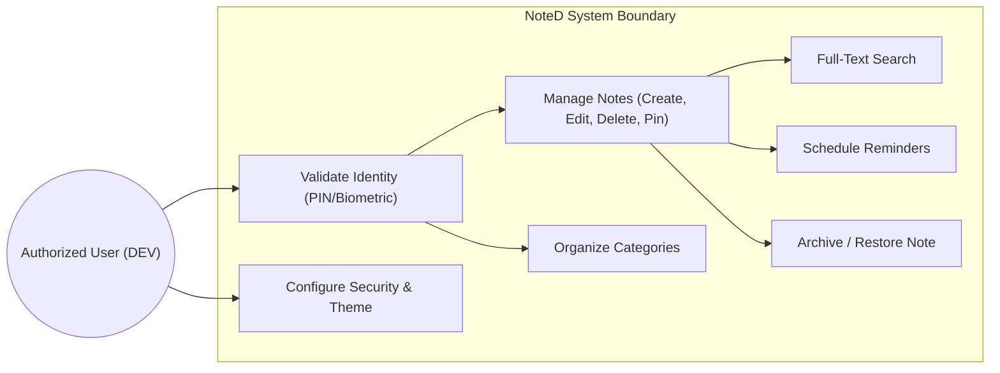

# NoteD — Secure offline-First Android Note-Taking & Organization System

[](https://kotlinlang.org)
[](https://developer.android.com)
[](https://developer.android.com/topic/architecture)
[](https://developer.android.com/jetpack/compose)
[](https://developer.android.com/training/data-storage/room)
[](https://developer.android.com/topic/security/data)

**NoteD** is a production-ready, highly secure, offline-first personal information manager and note-taking application designed for modern mobile devices. Authored by **DEV**, NoteD incorporates rigid hardware-backed biometric security, background reminder engines, and responsive Jetpack Compose components. Keeping user privacy at the forefront, all notes, categories, and reminders are processed and stored strictly local on-device.

---

## 🚀 Key Features Matrix

| Feature | Description | Engineering Implementation |
| :--- | :--- | :--- |
| **Rich Note Lifecycle** | Dynamic note generation, pin/unpin priority, soft archiving, and cascade deletions. | Jetpack Compose dynamic rendering, Local Room Queries |
| **Categorization Engine** | Custom user-defined folders/categories with individual color assignments and quick filtering. | Room SQLite Relational Schemas & Flows |
| **App Lock & Security** | Comprehensive security shield protecting user data using local cryptographic pins and biometrics. | `BiometricPrompt` API, PBKDF2 derivative checks |
| **Offline-First Persistence** | Instantaneous load times and complete offline operational stability. | Local SQLite SQLite-backed WAL Room storage |
| **Data Protection** | Local application settings and status variables are stored securely with hardware encryption support. | Android Jetpack `EncryptedSharedPreferences` |
| **Persistent Reminders** | Scheduling systems for periodic/one-off note notifications. Works across device reboots. | `AlarmManager`, Broadcast Receivers, & persistence |
| **Elastic Global Search** | Real-time full-text search across notes, body fields, and folders. | SQL `LIKE` queries with live StateFlow stream pipelines |
| **Fluid Themes** | Adapts dynamically to system dark mode or application-wide preferences. | Material Design 3 (M3) Color Schemes |

---

## 🛠 Tech Stack & Dependencies

- **Language:** 100% Kotlin with modern Coroutines and asynchronous state modeling via Flow/StateFlow.
- **Declarative UI:** Jetpack Compose with Material Design 3 theme catalogs, dynamic layouts, and interactive UI component classes.
- **Architecture:** Unidirectional Data Flow (UDF) implemented through structured MVVM design patterns.
- **Local Database:** Room persistence library for reliable structural mapping of SQLite query blocks.
- **Background Operations:** WorkManager and System Alarm Scheduling (`AlarmManager`) for highly reliable notification broadcasts.
- **Local Security Matrix:** Android Biometrics API for hardware verification and Jetpack Security cryptoframeworks for shared preferences.

---

## 📊 System Use Case Overview

The following diagram captures the system interactions and core actions available to the user under secure validation:



---

## 🏛 Software Architecture Summary

NoteD implements a clean, decoupled **layered MVVM architecture** utilizing Unidirectional Data Flow (UDF) principles.

```
       ┌────────────────────────────────────────────────────────┐
       │                      UI LAYER                          │
       │  [Compose Screens] ──► [Events] ──► [ViewModel]        │
       │         ▲                             │                │
       │         └────── [UI State Flow] ◄─────┘                │
       └────────────────────────┬───────────────────────────────┘
                                │ (Calls methods / Observes Flows)
                                ▼
       ┌────────────────────────────────────────────────────────┐
       │                  REPOSITORY LAYER                      │
       │                    [NoteRepository]                    │
       └────────────────────────┬───────────────────────────────┘
                                │ (Binds local sources)
                        ┌───────┴───────┐
                        ▼               ▼
       ┌────────────────────────┐  ┌────────────────────────────┐
       │    DATABASE SOURCE     │  │       SECURITY DATA        │
       │   [Room SQLite DB]     │  │  [SecurePreferencesManager]│
       └────────────────────────┘  └────────────────────────────┘
```

Detailed software specifications are available in the [Comprehensive Software Architecture Document](docs/SOFTWARE_ARCHITECTURE.md).

---

## 📁 Repository Directory Structure

```lispt
.
├── app
│   ├── build.gradle.kts        # Module build configuration & system dependencies
│   └── src
│       ├── main
│       │   ├── AndroidManifest.xml # Entry declarations, permissions, app receivers
│       │   ├── java/com/example
│       │   │   ├── NoteApplication.kt  # App level global startup file
│       │   │   ├── MainActivity.kt     # Hardware Biometric Entry point Activity
│       │   │   ├── data
│       │   │   │   ├── local
│       │   │   │   │   ├── dao         # SQLite Room CRUD operations interfaces
│       │   │   │   │   ├── database    # Database controller & migration pathways
│       │   │   │   │   └── entity      # Entity objects: Note, Category, Reminder
│       │   │   │   └── repository      # Clean repo implementation abstract models
│       │   │   ├── reminder
│       │   │   │   ├── AlarmManagerEngine  # Alarm setup logic, notifications
│       │   │   │   ├── BootReceiver.kt      # Listens to reboots to reschedule events
│       │   │   │   └── ReminderReceiver.kt  # Emits alerts upon broadcast timers
│       │   │   ├── security
│       │   │   │   ├── BiometricHelper.kt   # System hardware biometrics verification
│       │   │   │   └── SecurePreferencesManager.kt # Symmetric AES encrypted preferences
│       │   │   └── ui
│       │   │       ├── navigation  # Compose declarative screen pathways
│       │   │       ├── screens     # Responsive Compose UI screen definitions
│       │   │       ├── theme       # M3 customized Color schemes and typography
│       │   │       └── viewmodel   # Reactive StateFlow MVVM controller
│       │   └── res                 # System dynamic icons, layout vector maps
│       └── test/java/com/example   # Unit & Robolectric testing frameworks
└── docs/                           # Deep Architectural & Engineering Documentation
```

---

## 🛠️ Installation & Building Guide

### Prerequisites
- **Android Studio Jellyfish / Ladybug (or newer)**
- **Java SDK (JDK):** Version 17
- **Gradle Version Support:** 8.3+
- **Min Android SDK Version Protection:** API level 26 (Android 8.0)
- **Target Android SDK Compliance:** API level 34 (Android 14.0)

### Quick Start Instructions
1. **Clone the repository:**
   ```bash
   git clone https://github.com/DEV/NoteD.git
   cd NoteD
   ```
2. **Open the Project in Android Studio:**
   - Go to `File -> Open` and select the cloned root directory.
   - Wait for Gradle to download dependencies and sync the dependencies.
3. **Build the Debug Application:**
   - Click on the standard build option or use the gradle commands to compile the binary:
   ```bash
   gradle build
   ```
4. **Deploy onto Emulator / Device:**
   - Hit **Run** (`Shift + F10`) to compile and flash the application to your debugging environment.

For deep enterprise deployment, review the complete [Installation and Build Manual](docs/USER_AND_INSTALLATION_GUIDE.md#installation-guide).

---

## 📚 Deep Documentation Guides

To provide robust documentation for portfolio presentation, code evaluations, or internship checks, explore the detailed sub-documents in the `docs/` folder:

- 🏛️ **[docs/SOFTWARE_ARCHITECTURE.md](docs/SOFTWARE_ARCHITECTURE.md)**: Thorough architecture explanations, design decisions, UML Component diagrams, Sequence flow diagrams, and Class layouts.
- 🗄️ **[docs/DATABASE_AND_SECURITY.md](docs/DATABASE_AND_SECURITY.md)**: Full database schema descriptions, Entity-Relationship (ER) physical mapping schema, and detail metrics on cryptographic secure storage and biometrics.
- 📱 **[docs/USER_AND_INSTALLATION_GUIDE.md](docs/USER_AND_INSTALLATION_GUIDE.md)**: Detailed step-by-step walkthrough of application screens alongside instructions on build environments.
- 🧪 **[docs/TESTING_AND_FUTURE.md](docs/TESTING_AND_FUTURE.md)**: Complete analysis of our testing strategies, Robolectric simulations, local unit parameters, and the future development roadmap.

---

## 📜 License & Copyright

Designed and engineered by **DEV**. Under active maintenance. 
All source code and resource packages are released under the **MIT License**.

```
Copyright (c) 2026 DEV

Permission is hereby granted, free of charge, to any person obtaining a copy
of this software and associated documentation files (the "Software"), to deal
in the Software without restriction, including without limitation the rights
to use, copy, modify, merge, publish, distribute, sublicense, and/or sell
copies of the Software, and to permit persons to whom the Software is
furnished to do so, subject to the following conditions:

The above copyright notice and this permission notice shall be included in all
copies or substantial portions of the Software.
```
