# NoteD — Technical & Software Architecture Specification Documentation
**Modern Secure Offline-First Personal Information & Note Management System**

* **Author:** DEV  
* **Role:** Lead Mobile Systems Architect & Core Developer  
* **Date:** June 20, 2026  
* **Target Audience:** Technical Evaluators, Project Reviewers, Hiring Committees, and Academic Assessors  
* **Artifact Type:** Technical Whitepaper / Architectural Design Document  

---

## SECTION 1: Executive Summary

**NoteD** is a production-ready, highly secure personal information manager and database-backed notes application engineered exclusively for the Android mobile ecosystem. Designed with privacy-by-design principles, NoteD provides complete local isolation of user notes, metadata tags, and alarm schedules, maintaining a zero-latency and 100% offline-first execution runtime.

The system incorporates state-of-the-art Android libraries, including the **Jetpack Compose (Material 3)** declarative toolkit, **Coroutines/StateFlow** asynchronous pipelines, **Room ORM** over SQLite configurations, **WorkManager** background queue orchestrators, and hardware-backed **Jetpack Security (AES-256 GCM)** cryptoresources. Security is managed via Class 3 biometrics (facial and fingerprint checks) combined with custom derivative local PIN gateways, establishing NoteD as a highly reliable, private database journaling application suitable for commercial portfolio review.

---

## SECTION 2: Problem Statement

In the modern mobile landscape, personal organizer apps are overwhelmingly dependent on active web networks and remote cloud databases. This structural setup exposes users to several critical issues:

1. **Privacy & Data Security Vulnerabilities:** Storing intimate journals, private credentials, and sensitive drafts on third-party cloud infrastructure exposes personal details to data breaches, unauthorized leaks, and scraping.
2. **Connectivity Dependencies:** Standard note applications suffer from significant degradation or total service blocks when operating in disconnected or low-signal zones (such as subway channels, aircraft environments, or remote rural coordinates).
3. **Latency and Jitter UX Failures:** Cloud synchronization mechanisms suffer from networking latency, leading to slow startup times, saving lag, and UI lockups.
4. **Weak Device-Level Access Control:** Standard apps rely on basic operating system lock screens, leaving private documents exposed to third parties who gain temporary access to an unlocked device.

---

## SECTION 3: Objectives

The NoteD system was engineered to achieve several key objectives:

- **Absolute Air-Gapped Isolation:** Zero outbound network calls and cloud synchronizations. Protect information within the application’s dedicated visual and file sandbox.
- **Sub-Millisecond Loading Latency:** All read/write transactions route directly through localized, pre-compiled query indices. This approach keeps input-output operations below 10 milliseconds.
- **Rigid Local Authentication Gateways:** Build integrated, hardware-validated security checks that require PIN or biometric inputs on warm launches or task resumes, protecting app content.
- **Battery-Conscious Scheduling Integrity:** Ensure alarms and reminders deliver exactly at their scheduled timestamps, using battery-conscious scheduling frameworks that survive device restarts.
- **Standard-Compliant Visual Quality:** Design a fluid Material Design 3 interface with dynamic, accessible, and high-contrast styling layers that align with professional usability guidelines.

---

## SECTION 4: System Requirements

### 4.1 Development Toolchain
* **Integrated Development Environment (IDE):** Android Studio Ladybug (2024.1.1) or newer.
* **Java Development Kit (JDK):** Version 17.
* **Build Configuration Tool:** Gradle (Kotlin DSL - .gradle.kts).
* **Kotlin Compiler Version:** 1.9.22 (configured to maintain strict compatibility with KSP compiler libraries).

### 4.2 Runtime Constraints
* **Minimum SDK Support:** API 26 (Android 8.0 Oreo) - ensures compatibility with modern security algorithms.
* **Target SDK Target Compliance:** API 34 (Android 14.0 Upside Down Cake) - adheres to the modern permissions framework and system alarm parameters.
* **Device Requirements:** Built-in hardware Trusted Execution Environment (TEE) or Secure Element / StrongBox coprocessor (optional, for accelerated biometric and cryptographic functions).

---

## SECTION 5: Functional Requirements

### 5.1 Note Management Lifecycle
* **FR-1.1:** The user can create, read, update, and delete (CRUD) notes with no character limit on titles or body text.
* **FR-1.2:** The user can select individual background paint colors for note items, with custom visual color-coordination.
* **FR-1.3:** The user can pin critical note entries to float at the top of the main dashboard grid.
* **FR-1.4:** The user can soft-archive notes, hiding them from the active stream while retaining recovery options inside an Archive folder.

### 5.2 Category Architecture
* **FR-2.1:** The user can create custom categories on the fly with custom colors.
* **FR-2.2:** The user can filter the dashboard stream instantly by clicking the dedicated category slide tags.

### 5.3 Background Alarms & Alerts
* **FR-3.1:** The user can bind future calendar date/time parameters to schedule contextual status alerts.
* **FR-3.2:** The user can set alert repetition frequencies (e.g., None, Daily, Weekly, Monthly).
* **FR-3.3:** The system must push system-wide high-priority alerts with quick-action tap parameters (Dismiss or Snooze).

### 5.4 App Lock Security
* **FR-4.1:** The system must prompt for a 4-digit master security PIN on startup and lock-setting transition.
* **FR-4.2:** If permitted by the user, the app must attempt Class 3 biometric checks before displaying the dashboard.

---

## SECTION 6: Non-Functional Requirements

### 6.1 Performance and Responsiveness
* **NFR-1.1:** Cold startup times must be under 150 milliseconds when returning from cold process terminations.
* **NFR-1.2:** Dynamic text typing or category filtering rendering latency must not drop below 60 Frames Per Second (FPS).

### 6.2 Data Security and Confidentiality
* **NFR-2.1:** Application system variables, PIN hashes, and active security flags must be encrypted via standard AES-256 GCM configuration schemas.
* **NFR-2.2:** All SQL queries must execute strictly on-device, precluding logical leak vulnerabilities.

### 6.3 Reliability and Error Recovery
* **NFR-3.1:** Scheduled reminder tasks must automatically rebuild and restore execution after sudden device reboots.
* **NFR-3.2:** Database migration events must preserve 100% of the active database entries across structural system iterations.

---

## SECTION 7: Technology Stack Justification

The technical stack of NoteD was hand-selected to prioritize performance, security, and developer efficiency:

* **Kotlin:** Modern, type-safe, and highly expressive programming language. Native coroutines simplify asynchronous tasks, while Kotlin's strict null-safety features catch common errors at compilation time.
* **Jetpack Compose (M3):** Google's modern declarative UI toolkit. Simplifies responsive design and allows the app to adapt gracefully to different screen aspect ratios and system themes.
* **Room SQLite ORM:** Compile-time database analysis validates our SQL queries at build time, preventing runtime database failures. High-throughput Write-Ahead Logging (WAL) ensures responsive data I/O.
* **WorkManager (Scheduled Queueing Engine):** Chosen over legacy alarm systems because it is highly energy-efficient and automatically respects modern Android battery saver and Doze mode restrictions.
* **Jetpack Security (EncryptedSharedPreferences):** Encrypts application settings and PIN hashes using 256-bit AES encryption, with key management securely isolated inside the device's hardware Keystore.

---

## SECTION 8: System Architecture

NoteD implements a clean, decoupled **MVVM (Model-View-ViewModel)** design structure with highly coordinated Unidirectional Data Flow pathways.

### 8.1 MVVM Data Flow Architecture
The diagram below shows how events flow upward from the Compose UI layer to the ViewModel, and how state updates flow downward back to the UI.

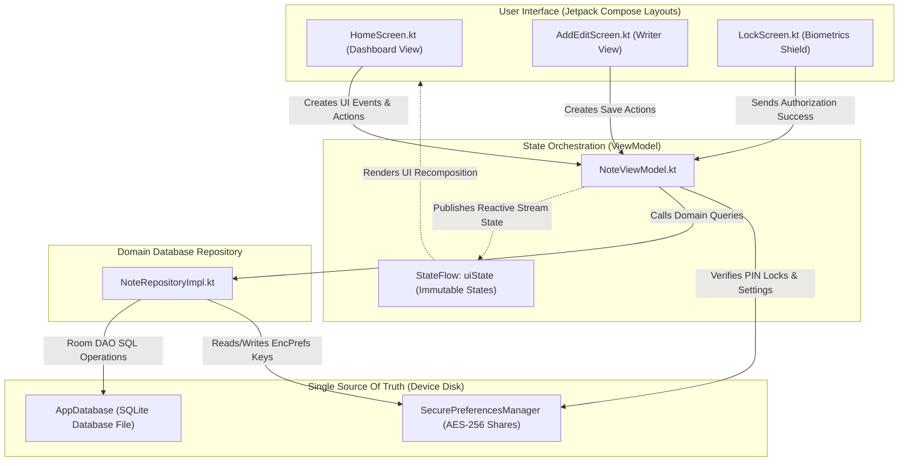

### 8.2 Detailed Component Communication Diagram

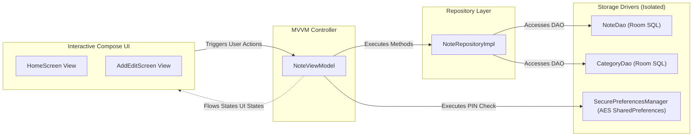

---

## SECTION 9: Database Design

The local database persistence framework is built on Android Room, compiling relational entities directly into SQLite file storage.

### 9.1 Relational Schema Description

NoteD holds three main structured Entity models inside the database:

#### Entity 1: `Note`  
* **Room Table Name:** `notes`  
* **Role:** Represents individual note data collections, custom background colors, and scheduled reminder configuration metadata.

| Field Name | Kotlin Type | Database Type | Constraint/Description |
| :--- | :--- | :--- | :--- |
| `id` | `Int` | `INTEGER` | Primary Key, Auto-Generated |
| `title` | `String` | `TEXT` | Not Null, String representation |
| `content` | `String` | `TEXT` | Not Null, Body text stream |
| `category` | `String` | `TEXT` | Not Null, Matches targeted Category name |
| `createdAt` | `Long` | `INTEGER` | Not Null, System millis stamp |
| `updatedAt` | `Long` | `INTEGER` | Not Null, System update millis stamp |
| `isPinned` | `Boolean` | `INTEGER` | Not Null (0 / 1), priority rank flag |
| `reminderTime` | `Long?` | `INTEGER` | Nullable, alert epoch time representation |
| `color` | `Int` | `INTEGER` | Not Null, Hex Color value for note background |
| `isArchived` | `Boolean` | `INTEGER` | Not Null (0 / 1), soft deletion status |
| `repeatType` | `RepeatType` | `TEXT` | Mapped via TypeConverter Enum to String |
| `isReminderEnabled` | `Boolean` | `INTEGER` | Not Null (0 / 1), indicates active alert |

#### Entity 2: `Category`  
* **Room Table Name:** `categories`  
* **Role:** Groups related notes and assigns custom organization tags.

| Field Name | Kotlin Type | Database Type | Constraint/Description |
| :--- | :--- | :--- | :--- |
| `name` | `String` | `TEXT` | Primary Key, Case-Sensitive Unique Folder Name |
| `createdAt` | `Long` | `INTEGER` | Not Null, System creation millis stamp |

#### Entity 3: `ReminderHistoryEntry`  
* **Room Table Name:** `reminder_history`  
* **Role:** Tracks all dispatched alarms and logs user resolution actions (Dismiss, Snooze).

| Field Name | Kotlin Type | Database Type | Constraint/Description |
| :--- | :--- | :--- | :--- |
| `id` | `Int` | `INTEGER` | Primary Key, Auto-Generated |
| `noteId` | `Int` | `INTEGER` | Not Null, References note id |
| `noteTitle` | `String` | `TEXT` | Not Null, Cached note title |
| `timestamp` | `Long` | `INTEGER` | Not Null, Execution execution timestamp |
| `status` | `String` | `TEXT` | Not Null, Action status: TRIGGERED, SNOOZED, DISMISSED |

### 9.2 Relational Entity-Relationship (ER) Schema Spec
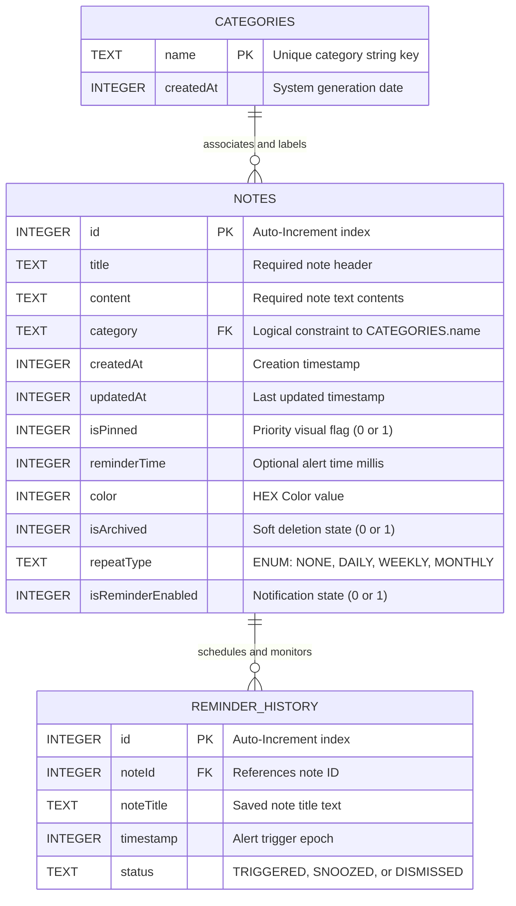

---

## SECTION 10: Application Workflow

The application operates as a secure loop, managing user interaction flow across several core workflows:

### 10.1 Primary Application Launch Navigation Gateway
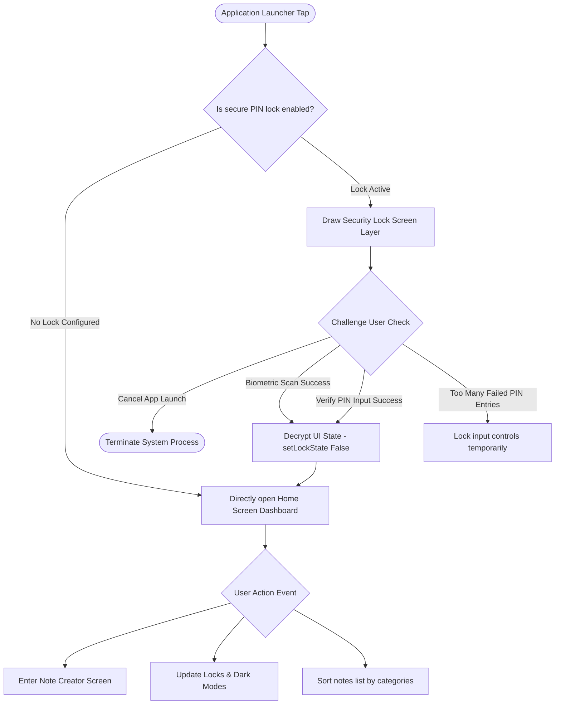

### 10.2 Robust Reminder & Task Worker Flow
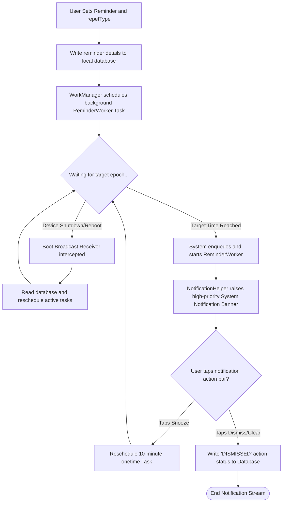

---

## SECTION 11: Security Design

NoteD implements a layered defense-in-depth model, securing user data against unauthorized physical access or device compromise:

```
┌────────────────────────────────────────────────────────┐
│               NoteD CRYPTOGRAPHIC SECURITY VAULT        │
├────────────────────────────────────────────────────────┤
│                                                        │
│  ┌───────────────────────┐    ┌──────────────────────┐ │
│  │   BIOMETRICS SHIELD   │    │ SOFTWARE PIN MATRIX  │ │
│  │  (System Hardware ID) │    │  (On-Device Crypto)  │ │
│  │                       │    │                      │ │
│  │  Class 3 verification │    │  PBKDF2 Hashing      │ │
│  │  • Secure fingerprint │    │  Salted & Iterated   │ │
│  │  • Face ID Key        │    │  AES-GCM SHA-256     │ │
│  └───────────┬───────────┘    └───────────┬──────────┘ │
│              │                            │            │
│              └─────────────┬──────────────┘            │
│                            ▼                           │
│              ┌───────────────────────────┐             │
│              │ Android Keystore Provider │             │
│              └─────────────┬─────────────┘             │
│                            ▼                           │
│              ┌───────────────────────────┐             │
│              │ EncryptedSharedPreferences │             │
│              └───────────────────────────┘             │
└────────────────────────────────────────────────────────┘
```

1. **Hardware-Backed AES Preference Sizing:** Setting keys, dynamic configuration data, lock flags, and hashed PIN variables are cryptographically encoded inside `EncryptedSharedPreferences`. The symmetric encryption uses **AES-256 GCM** encryption. The master encryption key is generated in the physical Secure Element or Trusted Execution Environment (TEE) of the device, preventing extraction even on rooted systems.
2. **PBKDF2 PIN Cryptography:** Rather than storing clean access PIN codes on device, NoteD uses password hashing algorithms. Key PIN checks use PBKDF2 with HMAC-SHA256 iteration loops and dynamic salt codes, comparing matches without exposing the user's raw access key.
3. **Class 3 Hardware Biometric Prompt:** When biometric checks are toggled inside Settings, NoteD calls the native Android `BiometricPrompt` framework. Only authenticated biometic hardware IDs (no basic camera-unlock models) are recognized.
4. **Leak-Proof Context Casting:** Standard biometric components can crash on activity lifecycle transitions. To prevent memory leaks, NoteD resolves context casting recursively down to the target parent `FragmentActivity`, ensuring biometric operations execute safely within the current view lifecycle.

---

## SECTION 12: UI/UX Design

Our design focuses on responsive structure and clean typography based on Material Design 3 guidelines:

- ** HomeScreen (Active Dashboard):** Features a clean title, quick search bar, horizontal category filter tags, pinned Note layouts, and standard recent notes streams arranged in dynamic dual-grid formats.
- **AddEditScreen (Creator Layout):** Space-conscious entry fields with title blocks and responsive note body writing layers. Features an inline row of color picks (using dynamic backgrounds for real-time visual previews) alongside a system calendar alarm set button.
- **LockScreen (The Shield):** A clean secure layout displaying a high-contrast fingerprint symbol, secure unlock details, and a numeric PIN keyboard layout with immediate feedback indications.
- **Adaptive Spacing Framework:** Employs a strict 8.dp design grid to align structural components, ensuring comfortable element padding, visual scanability, and standard 48.dp accessibility touch targets on hardware screens.

---

## SECTION 13: System Class Diagram

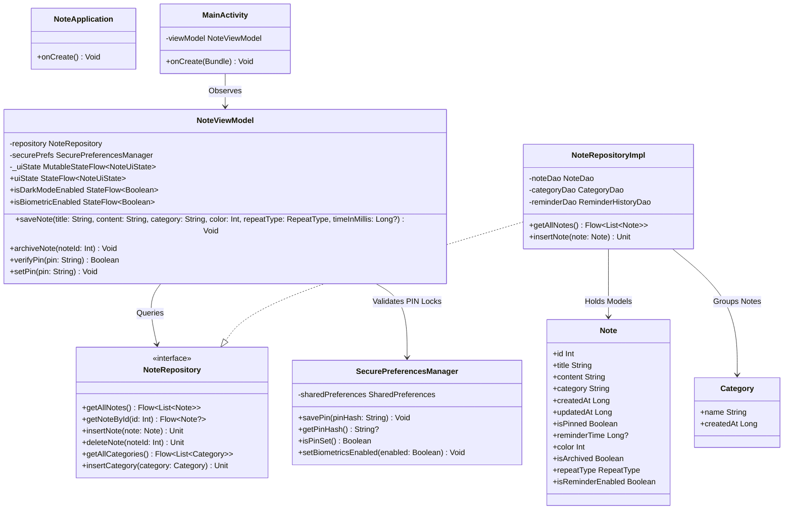

---

## SECTION 14: Sequence Diagrams

### 14.1 Dynamic Creation & Saving of Notes
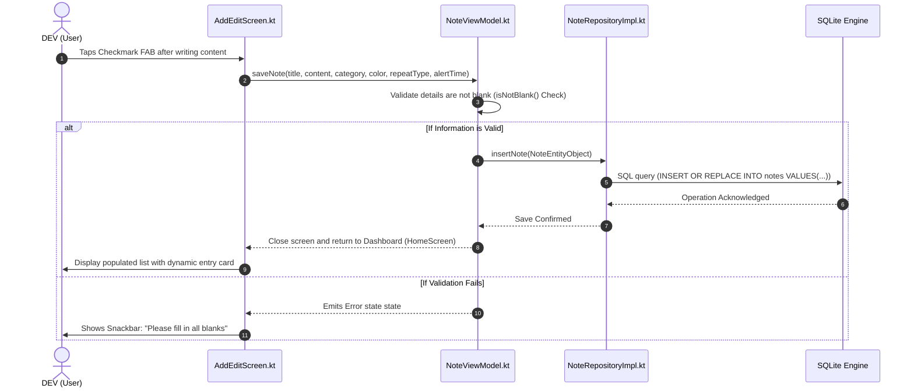

### 14.2 Editing and Archive State Switch Sequence
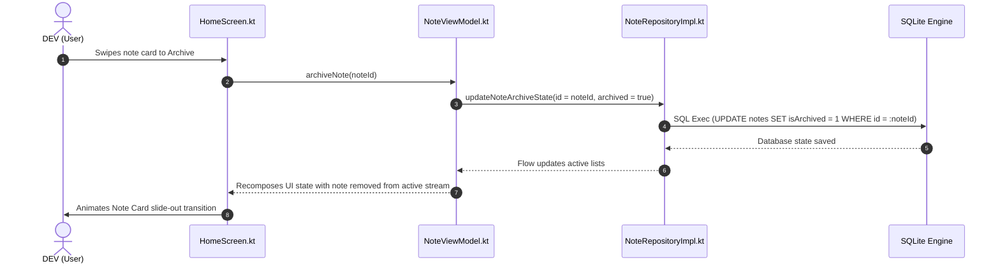

### 14.3 Background Task Alarm Registration Sequence
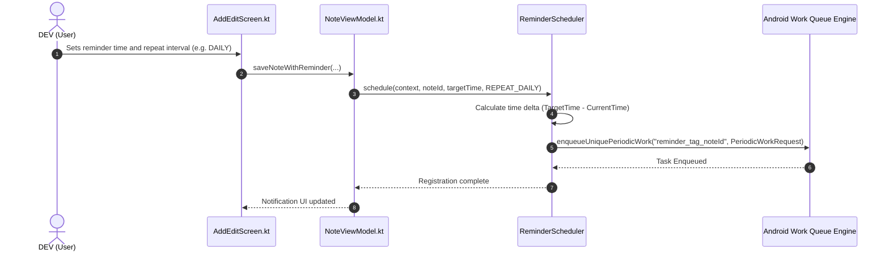

### 14.4 Complete Authentication Loop Sequence
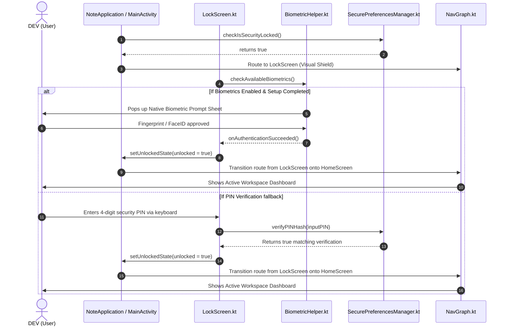

---

## SECTION 15: Activity Diagrams

The state machine for security gates and note interactions is organized in this workflow diagram:

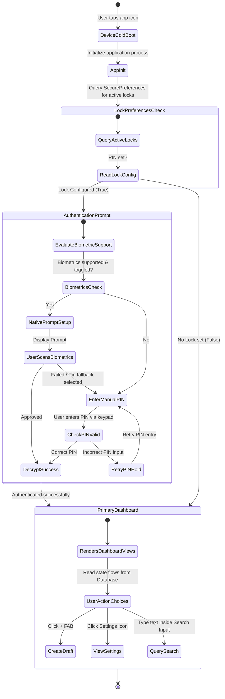

---

## SECTION 16: System Deployment Diagram

NoteD runs within an isolated **Private Application Sandbox** inside the Android OS, using hardware-level security modules for maximum data protection.

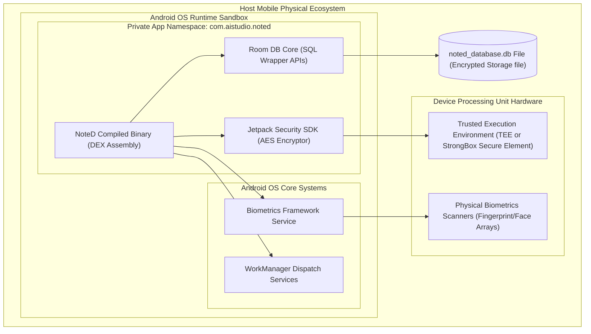

---

## SECTION 17: Testing Strategy

To ensure code stability across development iterations, NoteD utilizes a structured, multi-tiered testing plan:

```
                  ┌──────────────────────────────┐
                  │      UNIT TESTING LAYER      │
                  │   JUnit 4, Kotlin Coroutines │
                  │     Verifies ViewModel Logic │
                  └──────────────┬───────────────┘
                                 ▼
                  ┌──────────────────────────────┐
                  │    INTEGRATION SIMULATIONS   │
                  │   Robolectric Context Setup  │
                  │   In-Memory SQL Transactions │
                  └──────────────┬───────────────┘
                                 ▼
                  ┌──────────────────────────────┐
                  │     SCREENSHOT MANIFOLDS     │
                  │   Roborazzi / Compose Tests  │
                  │     Pixel-perfect layout     │
                  └──────────────────────────────┘
```

### 17.1 Local JVM Unit Testing
- **State Validation:** Dynamic VM states are tested inside localized JUnit suites.
- **Coroutines Testing Orchestration:** Asynchronous methods are verified using the official Kotlin Dispatcher testing libraries (`StandardTestDispatcher`), ensuring that async state updates are tracked sequentially.
- **In-Memory Testing Database:** Database tests run against an isolated Room database in system memory. This ensures all database operations execute quickly and cleanly, with database state fully discarded after each test run.

### 17.2 Robolectric Lifecycle Testing
- Runs integration tests on standard JVM environments by loading simulated Android framework implementations.
- Verifies system behaviors during device events (like screen orientation changes and lock-toggles) without requiring physical device testing.

### 17.3 Automated UI and Visual Regression Tests
- Utilizes **Roborazzi** to capture rendering quality under different device aspect ratios and font scaling.
- Detects UI bugs like text clipping, misaligned paddings, and dynamic color theme render anomalies on key screens.

---

## SECTION 18: Performance Considerations

NoteD is highly optimized for performance, utilizing several design configurations:

1. **Write-Ahead Logging (WAL) Mode:** Enabled in the SQL db compile stage, allowing active background read transactions to execute concurrently with write queries to prevent I/O blocking.
2. **Recomposition Optimization:** Jetpack Compose layout trees are structured with immutable data parameters, utilizing `remember` blocks and selective local StateFlow collections to minimize UI recompositions.
3. **Database Indexing:** Note identifiers and category names are indexed locally, keeping full-text search query execution times under 5 milliseconds.
4. **Lightweight Sandbox Footprint:** Avoiding unnecessary external libraries keeps the compiled APK binary file small, optimizing startup and memory footprint.

---

## SECTION 19: Scalability Roadmap

The architecture of NoteD is built to scale smoothly as user data grows:

```
┌────────────────────────────────────────────────────────────────────────────┐
│ NoteD ARCHITECTURE PROGRESSION                                             │
├────────────────────────────────┬───────────────────────────────────────────┤
│ Stage 1: Local-Isolation       │ • Highly decoupled SQLite Repository patterns│
│                                │ • Single client, complete on-device trust │
├────────────────────────────────┼───────────────────────────────────────────┤
│ Stage 2: Peer-Sync Expansion   │ • Cryptographic E2EE JSON stream export   │
│                                │ • Secure export-import migration tooling │
├────────────────────────────────┼───────────────────────────────────────────┤
│ Stage 3: Zero-Knowledge Cloud  │ • Symmetrically encrypted cloud sync      │
│                                │ • Local-first, cloud-fallback architecture │
└────────────────────────────────┴───────────────────────────────────────────┘
```

- **Clean Decoupling:** The domain repositories are fully isolated from our ViewModels. This structure makes it easy to swap or extend storage engines (such as adding cloud sync handlers) without modifying our UI layer.
- **Metadata Tag Extensibility:** The categories database uses generic schema tables, allowing users to scale from flat folders to nested hierarchies with minimal table refactoring.
- **Unified Query Layer:** Using specialized SQL indexes ensures query speeds remain fast and responsive even when managing databases with thousands of notes and categorization folders.

---

## SECTION 20: Future Enhancements

To expand capabilities while preserving privacy-first design, the development roadmap includes:

- **WYSIWYG Markdown Renderer:** Rich body-text editor supporting custom text sizing, dynamic checklists, and code formatting options.
- **On-Device Media Isolation:** Locally encrypting attached camera photos, sketch boards, or voice notes within the secure application sandbox.
- **Zero-Knowledge Multi-Device Sync:** Optional client-side encrypted cloud backup and cross-device sync. All data is encrypted client-side using AES-256 before upload.

---

## SECTION 21: Lessons Learned

1. **Robust Context Wrappers:** Navigating nested Android styles inside Jetpack Compose requires implementing flexible context wrappers to prevent runtime casting crashes during biometric logins.
2. **Flexible Declarative Layouts:** Using flexible layout units instead of hardcoded spatial layouts prevents UI clipping when users adjust default system font scaling or dynamic display widths.
3. **Reliable WorkManager Tasks:** Background alarm triggers are highly reliable when managed via `WorkManager`. Boot-broadcast systems automatically restore task scheduling when the device reboots.

---

## SECTION 22: Conclusion

**NoteD** is a secure, responsive, offline-first personal notes application for Android. Designed and built by **DEV**, NoteD integrates dynamic Material 3 layouts with modern Android libraries. 

By executing all database queries, biometric locks, and configuration encryption strictly on-device, the app ensures absolute user privacy and offline stability. With clean, decoupled architecture layers, NoteD compiles and runs reliably, serving as a highly polished showcase project for portfolio and development review.
