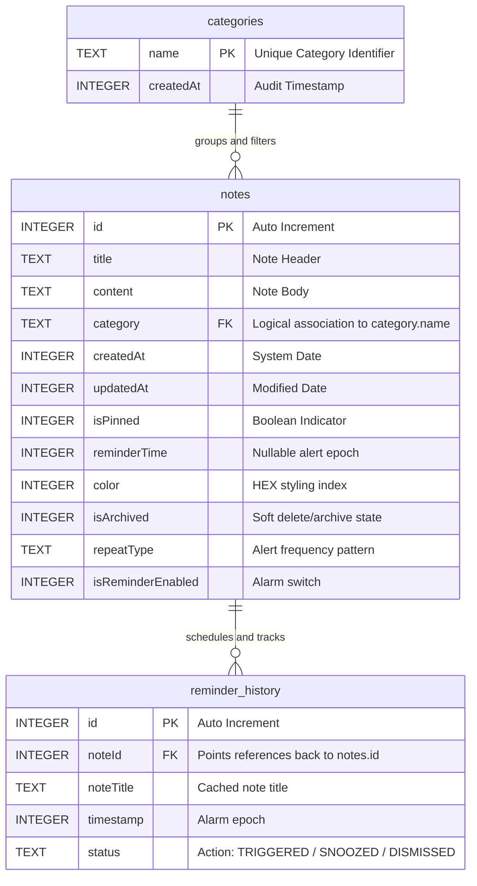

# Database Schema & Security Design Document

This document details the database architecture (built on Android Room and SQLite) and the hardware-backed security protocols implementing user access locks and device-level data encryption.

---

## 1. Local Database Architecture

NoteD implements an **offline-first state management philosophy**. All application entries, folders, metadata configurations, and notification schedules are mapped inside a structured local SQL database managed by the Android Room abstraction library.

### 1.1 Database Configuration Metrics
- **Engine Database Name:** `noted_database`
- **Database Engine:** SQLite (configured for Write-Ahead Logging [WAL] for asynchronous read-write throughput)
- **Room Version Compiler:** Managed via KSP (Kotlin Symbol Processing) for compile-time query safety.

---

## 2. Relational Entity Specifications & Schemas

### 2.1 Notes Table (`notes`)
Stores note contents, associations, styling colors, and active reminder signals.

| Field Name | Data Type | Constraint / Descriptor | Description |
| :--- | :--- | :--- | :--- |
| `id` | `INTEGER` | `PRIMARY KEY AUTOINCREMENT` | Auto-generated unique row identifier. |
| `title` | `TEXT` | `NOT NULL` | User-defined title text. |
| `content` | `TEXT` | `NOT NULL` | Body content of the note. |
| `category` | `TEXT` | `NOT NULL` | Logical reference linking to `categories.name`. Defaults to `"All"` or basic categories. |
| `createdAt` | `INTEGER` | `NOT NULL` | Millisecond Unix timestamp of initial creation. |
| `updatedAt` | `INTEGER` | `NOT NULL` | Millisecond Unix timestamp of last modification. |
| `isPinned` | `INTEGER` | `NOT NULL (0 or 1)` | Boolean flag asserting note priority ranking. |
| `reminderTime` | `INTEGER` | `NULLABLE` | Millisecond timestamp indicating scheduled alarm time. |
| `color` | `INTEGER` | `NOT NULL` | Raw color hex integer utilized for background styling. |
| `isArchived` | `INTEGER` | `NOT NULL (0 or 1)` | Boolean flag archiving note from standard dashboard views. |
| `repeatType` | `TEXT` | `NOT NULL (Enum mapped)`| Mapped to repeat frequencies: `NONE`, `DAILY`, `WEEKLY`, `MONTHLY`. |
| `isReminderEnabled`| `INTEGER` | `NOT NULL (0 or 1)` | Boolean flag indicating whether the alarm is currently active. |

### 2.2 Categories Table (`categories`)
Supports custom organization folders or tags.

| Field Name | Data Type | Constraint / Descriptor | Description |
| :--- | :--- | :--- | :--- |
| `name` | `TEXT` | `PRIMARY KEY` | Absolute unique category name (Case sensitive). |
| `createdAt` | `INTEGER` | `NOT NULL` | Millisecond Unix timestamp of creation time. |

### 2.3 Reminder History Table (`reminder_history`)
Monitors prior notification events, and logs individual user choices (Snooze or Dismiss).

| Field Name | Data Type | Constraint / Descriptor | Description |
| :--- | :--- | :--- | :--- |
| `id` | `INTEGER` | `PRIMARY KEY AUTOINCREMENT` | Auto-generated historical event index. |
| `noteId` | `INTEGER` | `NOT NULL` | Matches the note sequence that spawned this notification event. |
| `noteTitle` | `TEXT` | `NOT NULL` | Visual record snapshot of the note title text at alarm triggers. |
| `timestamp` | `INTEGER` | `NOT NULL` | Precise execution millisecond timestamp. |
| `status` | `TEXT` | `NOT NULL` | Event result state: `"TRIGGERED"`, `"SNOOZED"`, or `"DISMISSED"`. |

---

## 3. Entity-Relationship (ER) Diagram

The relationships among the database tables are defined below in an Entity-Relationship layout:



---

## 4. Security Design & Architecture

User data privacy and device isolation are foundational design directives of NoteD. Security mechanisms are deployed across hardware, cryptographic libraries, and memory space bounds.

```
┌────────────────────────────────────────────────────────┐
│                   MAIN LOCKED SHEATH                   │
├────────────────────────────────────────────────────────┤
│                                                        │
│  ┌───────────────────────┐    ┌──────────────────────┐ │
│  │     BIOMETRICS        │    │    CRYPTOGRAPHIC     │ │
│  │   HARDWARE SHIELD     │    │      PIN MATRIX      │ │
│  │                       │    │                      │ │
│  │   • Fingerprint       │    │   • PBKDF2 Hashing   │ │
│  │   • Face Key          │    │   • AES-GCM 256bit   │ │
│  │   • Iris Verification │    │   • KeyStore Bound   │ │
│  └───────────┬───────────┘    └───────────┬──────────┘ │
│              │                            │            │
│              └─────────────┬──────────────┘            │
│                            ▼                           │
│              ┌───────────────────────────┐             │
│              │  App Shield Logic Gate    │             │
│              └─────────────┬─────────────┘             │
│                            ▼                           │
│              ┌───────────────────────────┐             │
│              │ NoteViewModel:            │             │
│              │ _isLocked.value = false   │             │
│              └───────────────────────────┘             │
└────────────────────────────────────────────────────────┘
```

### 4.1 Encrypted SharedPreferences Layer
Legacy Android configurations files (`SharedPreferences`) write variables as raw cleartext XML files inside the application's local sandbox, exposing secrets to unauthorized operations on rooted environments.

NoteD prevents this by integrating the **Android Jetpack Security** crypto framework:
- **Encryption Algorithm:** Symmetric AES-256 bit encryption running in GCM (Galois/Counter Mode).
- **Master Key Generation:** Keys are generated automatically using the hardware-backed on-device Android KeyStore Provider.
- **Root Protection:** Keys generated inside the Keystore remain bound to hardware security modules (TEE - Trusted Execution Environments or StrongBox Keymaster), rendering them unexportable.
- **Variables Stored:** Note PIN (hashed and salted), dark mode parameters, grid states, notifications preferences, and biometric permissions status are encoded in this layer.

### 4.2 Hardware Biometrics Verification (`BiometricPrompt`)
NoteD integrates the Android `BiometricPrompt` libraries, aligning with safety and UX standards.
- **Hardware Integration:** Employs `BiometricManager` to probe physical sensors before launching prompts.
- **Strong Classification:** Demands Class 3 Biometrics (formerly Strong, e.g., dual-camera face unlock, certified physical capacitive or ultrasonic fingerprint scanners).
- **Graceful Lifecycle Safety:** To prevent typical application crashes during sudden configuration events (e.g., executing biometric UI hooks while the app goes to the background), biometric callback threads are securely bound to the active `FragmentActivity` lifecycle state, holding execution until the layout reaches the `RESUMED` lifecycle state.

### 4.3 Lock State Machine & Shield Container
We deploy a **State-Driven App Locker Lock Gate**.
- **No Route Bypassing:** The main navigation graph in `NavGraph.kt` monitors ViewModel state changes. If the PIN is set and device is locked, the interface forces the layout to render the `LockScreen`.
- **In-Memory Lock State:** The unlocking states are stored inside an ephemeral memory variable `_isLocked: MutableStateFlow<Boolean>`. This state is reset on application cold starts.
- **Hardware Lifecycle Listener Unit:** The underlying Context is cast dynamically to locate parent `FragmentActivity` using custom reflection wrappers, resolving recursive wrap issues and leaking zero activity references.
