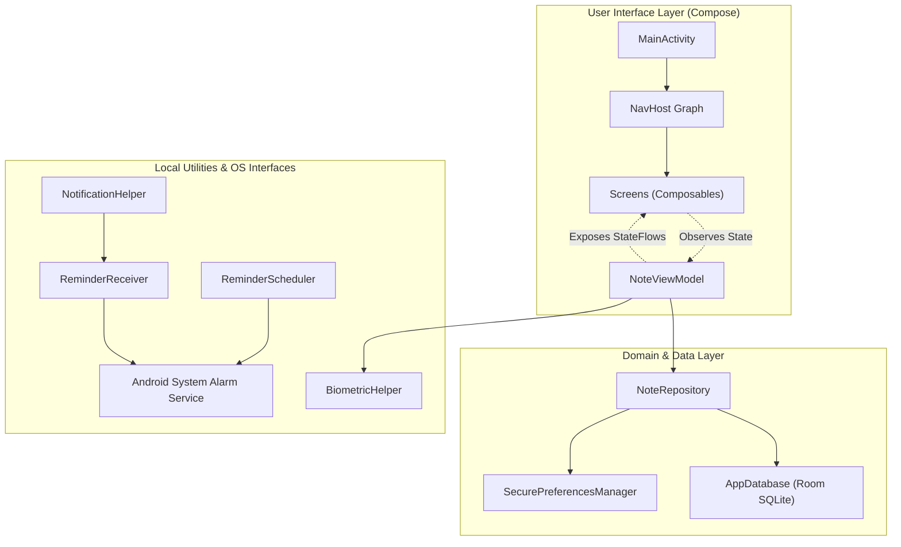
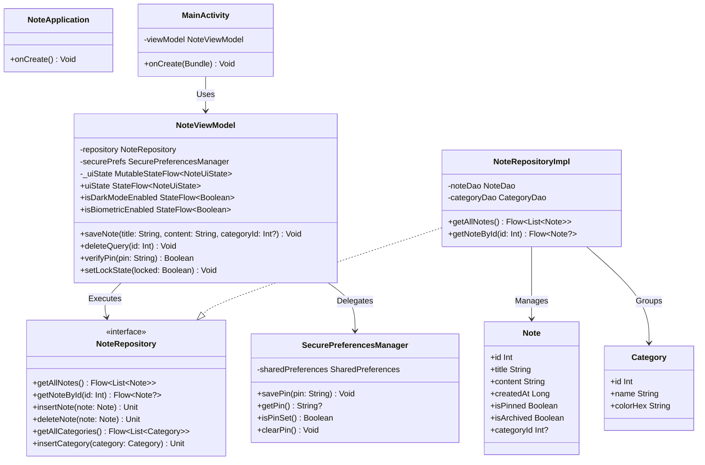
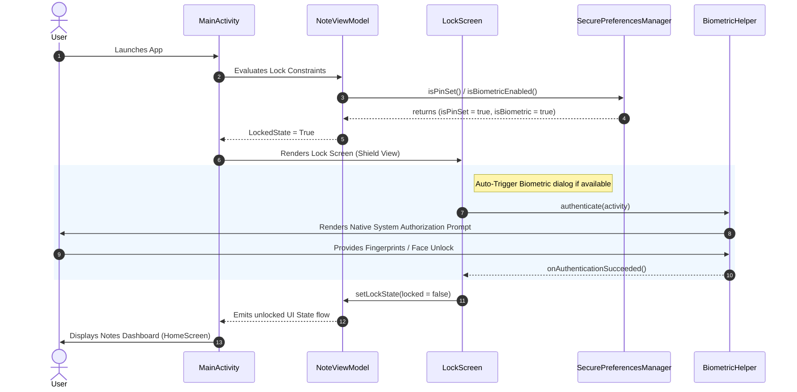
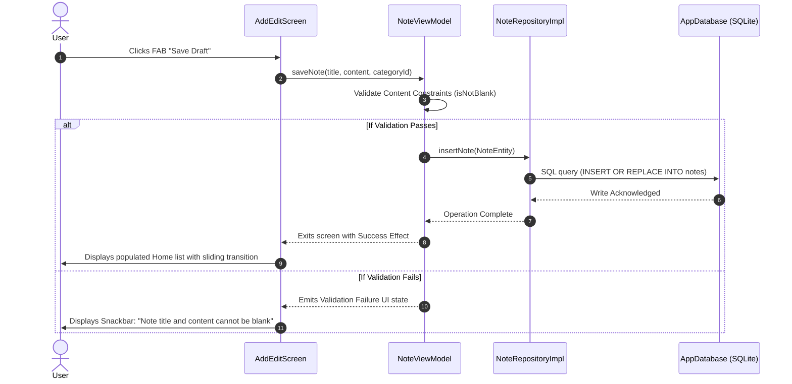
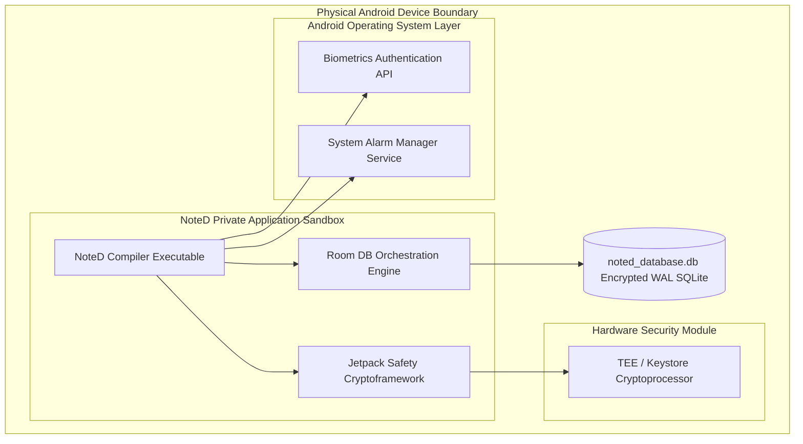

# Software Architecture & Technical Design Document

**Application Name:** NoteD  
**Author / Chief Architect:** DEV  
**Version:** 1.0.0  
**Technology Base:** Kotlin, Jetpack Compose, MVVM Architecture, Room Database, StateFlow, Coroutines, WorkManager, AlarmManager, Android Biometrics.

---

## 1. Architectural Summary & Style Guide

NoteD is programmed to use a modernized, declarative architecture pattern aligned with Google's canonical **Guide to App Architecture**. The application follows a rigid multi-tiered system separating UI, domain business logic, and local storage layers. Communication between layers is strictly regulated using unidirectional data flow lines and reactive state pipelines (`kotlinx.coroutines.flow`).

### Architectural Pillars
1. **Unidirectional Data Flow (UDF):** Event signals flow upwards from the Composable views (as UI actions), and dynamic application States flow downwards from the ViewModel (bound as immutable `StateFlow` structures).
2. **Offline-First Resilience:** Network connection state is decoupled from basic user interactions. The local SQLite database, abstracted by the Room Library or shared state components, is the **single source of truth** for NoteD.
3. **Decoupled Isolation of Concerns:** The core view models interact solely with domain abstract representations (Repositories). Views are kept lightweight and declarative to maximize maintainability.
4. **Defense-in-Depth Local Security:** Application configurations and pin derivatives are encrypted using hardware-backed cryptographic utilities combined with the Android Biometric SDK.

---

## 2. Component Design Diagram

The modular partition of NoteD is grouped into isolated sub-systems representing specific design dimensions. The following diagram maps these logical boundaries:

---

## 3. High-Level Class Diagrams

The object models inside NoteD are strongly typed. The Class Diagram below illustrates the structure of the repository patterns, entity models, and their association with the ViewModel layer:

---

## 4. Logical Sequence Flows

The sequence below describes the life-cycle flows for key interaction pipelines in the system.

### 4.1 Secure App Launch & Authentication Validation Flow

### 4.2 Dynamic Note Save Action Detail Flow

---

## 5. Architectural Design Decisions (ADRs)

To offer absolute transparency regarding the design process, the table below documents the architectural trade-offs resolved during the engineering of NoteD:

### ADR 01: Core Architecture — MVVM over MVC/MVP
- **Context:** Deciding on separation of concerns for the Android client app.
- **Decision:** Selected MVVM utilizing Unidirectional Data Flow. ViewModels retain data across device configuration anomalies (such as device rotation), whereas legacy patterns like MVP leak activity references during lifecycle redraws.
- **Traceability:** Implemented using `androidx.lifecycle.ViewModel` and Kotlin Flows.

### ADR 02: Storage Layer — Room SQL Database over SharedPreferences/Raw SQLite
- **Context:** Choosing storage for highly relational structured entities (Notes containing category and reminder relationships).
- **Decision:** Room abstracts SQLite with compile-time query analysis, avoiding unstable execution errors. SharedPreferences is structurally insecure and inefficient for deep collections, while manual SQLite code is error-prone.
- **Traceability:** Implemented under `/data/local/database/` with comprehensive SQL syntax parsing.

### ADR 03: Security — Symmetric AES-256 GCM Storage over Cleartext SharedPreferences
- **Context:** Pin configurations, reminder alerts details, and basic settings contain details requiring strict cryptographic security.
- **Decision:** Deployed Jetpack Security's `EncryptedSharedPreferences`. Encryption keys are symmetrically managed using Android's hardware Keystore, ensuring unauthorized rooted file browsers cannot compromise PIN states.
- **Traceability:** Configured and managed within `SecurePreferencesManager.kt`.

### ADR 04: Reactive Bindings — Flow/StateFlow over LiveData
- **Context:** Selecting reactive state vectors.
- **Decision:** Standard and StateFlows are native to Kotlin and support sophisticated threading operators (like flatMaps or debounce mechanisms). LiveData is structurally coupled to the Android OS toolkit, which introduces unnecessary platform dependence in domain logic calculations.
- **Traceability:** Integrated fully in screens using state management operators `.collectAsStateWithLifecycle()`.

---

## 6. System Deployment View

NoteD runs fully isolated inside the sandboxed user-space of the Android Operating System. There are no external clouds or background endpoints, creating an air-gapped system.

