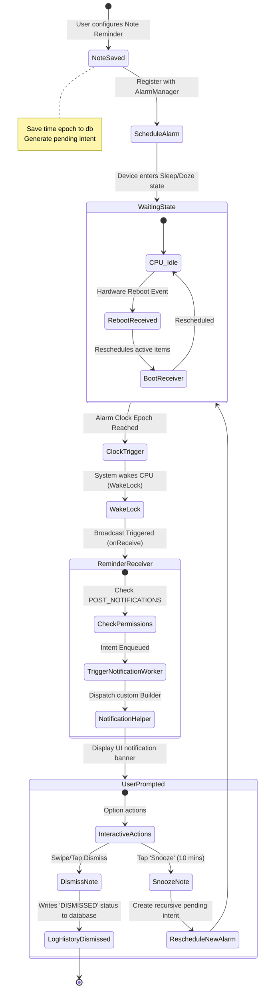

# Testing Strategy & Future Scope Roadmap (NoteD)

This document maps out our testing methodologies and quality assurance processes, followed by a future technology roadmap for NoteD.

---

# PART 1: Quality Assurance & Testing Strategy

To maintain reliability, NoteD is tested using a multi-tiered test pipeline. By utilizing a local mock database, we execute high-fidelity integration tests on the JVM without requiring a physical device or emulator.

```
                  ┌──────────────────────────────┐
                  │      UNIT & LOGIC TESTS      │
                  │   JUnit 4, Kotlin Coroutines │
                  │     Fast execution, JVM      │
                  └──────────────┬───────────────┘
                                 ▼
                  ┌──────────────────────────────┐
                  │    INTEGRATION SIMULATIONS   │
                  │    Robolectric Integration   │
                  │   In-Memory SQLite Database  │
                  └──────────────┬───────────────┘
                                 ▼
                  ┌──────────────────────────────┐
                  │     SCREENSHOT REGRESSIONS   │
                  │   Roborazzi / Compose Tests  │
                  │     Pixel-perfect checks     │
                  └──────────────────────────────┘
```

## 1. Unit Testing Strategy
- **ViewModel Tests (`NoteViewModelTest.kt`):** ViewModels are tested directly under different UI states. By injecting an in-memory SQL database, we can perform CRUD operations predictably without leaking state between tests.
- **Coroutines Testing:** Tests run on a custom `StandardTestDispatcher` (from the `kotlinx-coroutines-test` package) to manage cooperative concurrency. We use `runBlocking` or `runTest` scopes alongside shadow context loops (`shadowOf(Looper.getMainLooper()).idle()`) to complete asynchronous pipeline operations.

## 2. Robolectric Context Simulation
- **Why Robolectric:** Standard JVM testing does not support Android system classes (such as `Context`, `SharedPreferences`, or `Application`), which normally require an active emulator. Robolectric resolves this by loading simulated Android framework implementations.
- **Resource Verification:** Tests can mock changes to dark-theme settings, dynamic locale configurations, and configuration changes (device rotation) on the JVM within seconds.

## 3. UI and Screenshot Testing
- **Visual Regressions (Roborazzi):** NoteD is designed to support Robolectric screenshot tests. This records visual layouts under varying responsive dimensions. It compares them against baseline references, flagging padding misalignment, typography truncation, or asset clipping.

---

## 4. Notification & Alarm Lifecycle Activity Flow

Triggering reliable reminders on Android requires navigating strict operating system power constraints and device reboots. The diagram below details the NoteD registration and execution activity pipeline:



---

# PART 2: Future Technology Roadmap

To transition NoteD from a standalone private assistant into an interconnected productivity suite, the development roadmap includes several key features:

```
┌────────────────────────────────────────────────────────────────────────────┐
│ NoteD PROGRESSIVE ROADMAP                                                  │
├────────────────────────────────┬───────────────────────────────────────────┤
│ Q3 2026: Collaborative Media   │ • Markdown Editor & dynamic syntax highlight│
│                                │ • Local image and drawing attachments     │
├────────────────────────────────┼───────────────────────────────────────────┤
│ Q4 2026: Multi-Device Sync     │ • End-to-End Encrypted Peer Cloud replication│
│                                │ • Automated export backup / local ZIP     │
├────────────────────────────────┼───────────────────────────────────────────┤
│ Q1 2027: Enterprise Integrity   │ • Hardware-backed StrongBox integrations  │
│                                │ • Shared network spaces with biokinetics  │
└────────────────────────────────┴───────────────────────────────────────────┘
```

## 1. Markdown & Extended Content Support
The core text canvas will be upgraded to support dynamic Markdown parsing.
- **Rich Elements:** Implement interactive lists (checking boxes inside body text), custom codeblocks, and hyperlinked inline targets.
- **Dynamic Syntax Highlighting:** Enable automatic styling of Markdown syntax within the editor view.

## 2. Multi-Media & Drawing Attachments
Extend the database model to support relationships with external file binary streams.
- **Images & Drawings:** Integrate an interactive vector canvas for sketching notes, as well as attachments for camera photos and local images.
- **Audio Recorders:** Enable capturing voice memos directly within note entries, utilizing background recording processes.

## 3. End-to-End Encrypted Database Synchronization
While remaining offline-first, NoteD will introduce secure cross-device synchronization:
- **Zero-Knowledge Architecture:** User databases will be synchronized across multiple devices using a zero-knowledge architecture. Note contents, category tags, and reminders will be encrypted on-device with the user's password using AES-256-GCM before uploading to cloud backups.
- **Conflict Resolution:** Build automated, timestamp-based conflict resolution algorithms to clean data state across concurrent device updates.

## 4. Hardware Master Vault (StrongBox Support)
For devices supporting specialized cryptoprocessors (such as Pixel Titan M chips):
- NoteD will upgrade cryptographic preferences to utilize Android `StrongBox` keymaster profiles.
- This binds our master symmetric keys to hardware-isolated storage, providing tamper-resistant protection against hardware-level security attacks.
